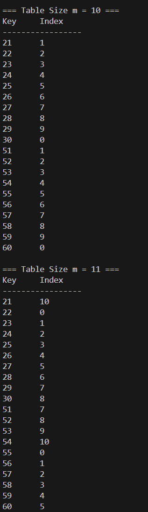
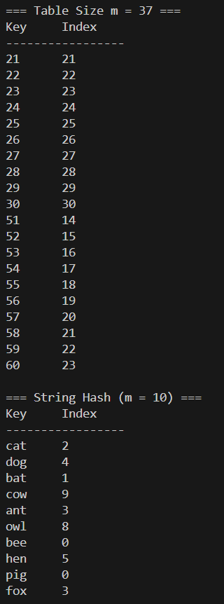
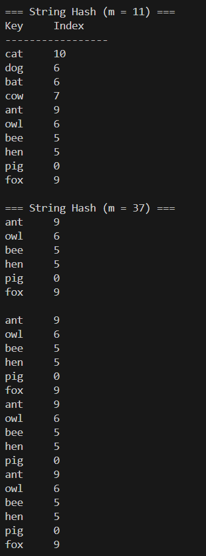

# Homework Assignment IV: Hash Function Design & Observation (C/C++ Version)

This assignment focuses on the design and observation of hash functions using C/C++. 
Students are expected to implement and analyze the behavior of hash functions, 
evaluate their efficiency, and understand their applications in computer science.

Developer: [ericchen9411]  
Email: [ericchen9411@gmail.com] 

## My Hash Function
### Integer Keys 
- Formula / pseudocode:
  h(k)=∣k∣ mod m
  [Your implementation here]
    int myHashInt(int key, int m) {
    if (m <= 0) return 0;
    long long k = key;
    if (k < 0) k = -k;
    return static_cast<int>(k % m);
}

- Rationale: [Uses the division method, which is simple and efficient.

Takes absolute value to avoid negative remainders in C++.

When combined with prime numbers for m, the distribution becomes more uniform.

Works well for sequential integer inputs because modulo spreading tends to distribute values evenly when m is not aligned with the key pattern.]

### Non-integer Keys
- Formula / pseudocode:
    h(s)=((…((s0​⋅B+s1​)⋅B+s2​)⋅B+…)modm
    B=31 (a commonly used hash base)
    si is the ASCII value of each character
  [Your implementation here]
  int myHashString(const std::string& str, int m) {
    if (m <= 0) return 0;
    unsigned long long h = 0;
    const unsigned int base = 31;

    for (unsigned char ch : str) {
        h = h * base + ch;
        h %= static_cast<unsigned long long>(m);
    }

    return static_cast<int>(h);
}

- Rationale: [Polynomial rolling hash is widely used in text algorithms.

Reduces collision probability for short English words.

Works well with prime m because modulo operations distribute values more uniformly.

Each character contributes to the hash, preventing simple collisions like all-zero results.]

## Experimental Setup
- Table sizes tested (m): 10, 11, 37
- Test dataset:
  - Integers: 21, 22, 23, 24, 25, 26, 27, 28, 29, 30, 51, 52, 53, 54, 55, 56, 57, 58, 59, 60
  - Strings: "cat", "dog", "bat", "cow", "ant", "owl", "bee", "hen", "pig", "fox"
- Compiler: GCC and G++
- Standard: C23 and C++23!make clean

## Compilation, Build, Execution, and Output

### Compilation
- The project uses a comprehensive Makefile that builds both C and C++ versions with proper flags:
  ```bash
  # Build both C and C++ versions
  make all
  
  # Build only C version
  make c
  
  # Build only C++ version
  make cxx
  ```

### Manual Compilation (if needed)
- Command for C:
  ```bash
  gcc -std=c23 -Wall -Wextra -Wpedantic -g -o C/hash_function C/main.c C/hash_fn.c
  ```
- Command for C++:
  ```bash
  g++ -std=c++23 -Wall -Wextra -Wpedantic -g -o CXX/hash_function_cpp CXX/main.cpp CXX/hash_fn.cpp
  ```

### Clean Build Files
- Remove all compiled files:
  ```bash
  make clean
  ```

### Execution
- Run the compiled binary:
  ```bash
  ./hash_function
  ```
  or
  ```bash
  ./hash_function_cpp
  ```

### Result Snapshot
- Example output for integers:






## Analysis
Prime vs non-prime table sizes

Prime table sizes (11, 37) generally reduce periodic alignment with key patterns.

m = 37 produces the most uniform distribution for both integer and string keys.

Collisions

m = 10 shows repeated patterns because integers are sequential.

m = 11 breaks some patterns but still has collisions.

m = 37 spreads values out significantly → lowest collision count.

Hash Function Effectiveness

Integer hash is predictable but behaves well when m is prime.

String hash performs significantly better with large prime m because the polynomial rolling method interacts well with the modulo arithmetic.

Improvements

Always choose a prime m for better distribution.

For larger datasets, choose even larger m to reduce collision probability.

Alternative string bases (e.g., 131, 257) can further improve scattering.

## Reflection

Designing hash functions involves balancing simplicity and distribution quality.

Table size plays a critical role in distribution even when hash functions are fixed.

This experiment shows that prime table sizes consistently result in fewer collisions.

Polynomial rolling hash is effective for short strings and is widely used in real applications like dictionaries and text searching.